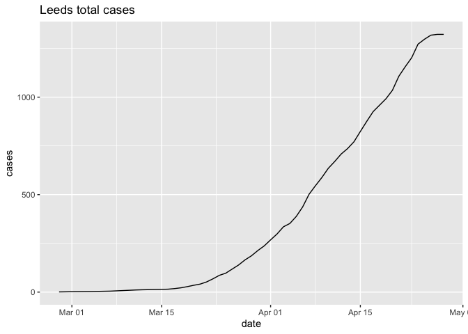

# covid19uk

Some basic analysis to go with the eAtlas covid19UK application.

Currently the date released by PHE in their dashboard can be found under
their React app which is made of two API endpoints. These are:

  - [XML](https://publicdashacc.blob.core.windows.net/publicdata?restype=container&comp=list)
    of data released.
  - [actual](https://c19pub.azureedge.net/) endpoint to the data.

Understanding the structure of the data released:

``` r
# see phe.R for details of the code.
source("phe.R")
```

``` r
# data from phe is
names(json)
```

    ## [1] "lastUpdatedAt" "disclaimer"    "overview"      "countries"    
    ## [5] "regions"       "utlas"

``` r
# so last released data is
json$lastUpdatedAt
```

    ## [1] "2020-04-20T15:59:38.910841Z"

Nicely, they also release geometries and we can generate maps. For
example to get thee latest figures of the regions:

``` r
utlasWithCases = addCasesToUTLAs(utlas, json)
plot(utlasWithCases[,"totalCases"])
```

<!-- -->

A simple function in the `phe.R` file can also take a specific date, the
data starts from `31st of Jan`. So lets use the lockdown date of
`2020-3-23` and seee what the UK looked liek back then:

``` r
date = "2020-03-20"
utlasWithCases = addCasesToUTLAs(utlas, json, date)
plot(utlasWithCases[,"totalCases"], main = date)
```

<!-- -->

The greater London:

``` r
date = "2020-03-23"
utlasWithCases = addCasesToUTLAs(utlas, json, date)
bbx = osmdata::getbb('Greater London, U.K.') 
bbx = c(xmin = bbx[1,1], ymin = bbx[2,1], xmax = bbx[1,2], ymax = bbx[2,2])
london = st_crop(utlasWithCases, bbx)
```

    ## although coordinates are longitude/latitude, st_intersection assumes that they are planar

``` r
plot(london[,"totalCases"], main = paste0("London on ", date))
```

<!-- -->

And we can see a line chart of, say Leeds:

``` r
library(ggplot2)
cityWithDaily = function(name = "Leeds", total = FALSE) {
  la = utlas$ctyua19cd[utlas$ctyua19nm == name]
  la = json$utlas[[la]]
  cc = as.data.frame(la$dailyConfirmedCases)
  if(total) {
      cc = la$dailyTotalConfirmedCases
  }
  # cc = data.frame(matrix(unlist(cc), nrow=length(cc), byrow=T))
  names(cc) = c("date", "cases")
  cc$date = as.POSIXct(as.character(cc$date))
  cc$cases = as.numeric(as.character(cc$cases))
  cc
}
# cityWithDaily() %>% ggplot(aes(date,cases)) + geom_bar(stat="identity")
cityWithDaily(total = T) %>% ggplot(aes(date,cases)) + geom_line()
cityWithDaily() %>% ggplot(aes(date,cases)) + geom_line()
```


Total cases for Leeds on the left and daily ones on the right.

Lets get some population data:

``` r
pop = readxl::read_xls("~/Downloads/ukmidyearestimates20182019ladcodes.xls", sheet = 6)
names(pop) = pop[4,]
pop = pop[5:nrow(pop),]
pop = pop[!is.na(pop$`All ages`), ]
# are they in here?
m = match(utlasWithCases$ctyua19cd, pop$Code)
# length m = nrow(utlasWithCases) == 173
pop$`All ages` = as.numeric(pop$`All ages`)
# pop[pop$Name == "Leeds","All ages"]
# boxplot(pop[pop$Geography1 == "Unitary Authority", "All ages"])
```

Now we can calculate the infection rate of (1/100K) for each of them

``` r
utlasWithCases = addCasesToUTLAs(utlas, json)
utlasWithCases$population = pop[m,][["All ages"]]
utlasWithCases$ir = utlasWithCases$totalCases/(utlasWithCases$population/1e5)
plot(utlasWithCases[,"ir"], main = paste0("Infection rate per 100k on ", Sys.Date()))
```

<!-- -->
